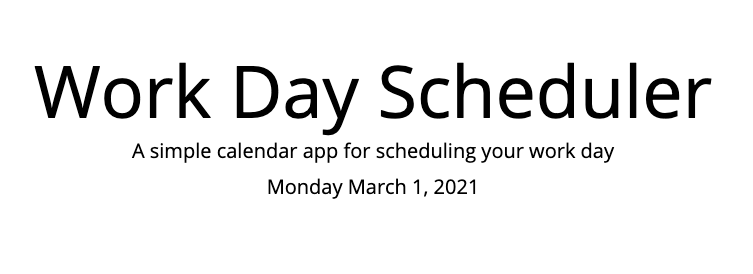

# Workday-Scheduler

## Description 

Hi, 

Hello "busy", You need planner for organize yourself?

Here you can manage your plans.
pick a block where you have a plan or things you may have,
simply type in, and it will keep track of your work

## Table of Contents (Optional)

* [Installation](#installation)
* [Usage](#usage)
* [Technology](#technology)
* [Credits](#credits)
* [License](#license)

## Installation

- Please visit Website https://richardyjkim.github.io/workday-scheduler/

## Usage 

-Introducing workday-scheduler, 
start manage your schedule from today

-with standard business hours (9am-5pm)

-dont know what time is in between?
no worries it will tell you by its color
"gray"=past
"red"=now
"green"=future

-dont forget to save your task, other wise it will vanish

## Technology
    -HTML
    -CSS
    -Java Script
    -JQuery
    -Bootstrap

## Credits

 - Richard Kim: richardyjkim (github)

## License

MIT License

Copyright (c) [2021] [Richard Y Kim]

Permission is hereby granted, free of charge, to any person obtaining a copy
of this software and associated documentation files (the "Software"), to deal
in the Software without restriction, including without limitation the rights
to use, copy, modify, merge, publish, distribute, sublicense, and/or sell
copies of the Software, and to permit persons to whom the Software is
furnished to do so, subject to the following conditions:

The above copyright notice and this permission notice shall be included in all
copies or substantial portions of the Software.

THE SOFTWARE IS PROVIDED "AS IS", WITHOUT WARRANTY OF ANY KIND, EXPRESS OR
IMPLIED, INCLUDING BUT NOT LIMITED TO THE WARRANTIES OF MERCHANTABILITY,
FITNESS FOR A PARTICULAR PURPOSE AND NONINFRINGEMENT. IN NO EVENT SHALL THE
AUTHORS OR COPYRIGHT HOLDERS BE LIABLE FOR ANY CLAIM, DAMAGES OR OTHER
LIABILITY, WHETHER IN AN ACTION OF CONTRACT, TORT OR OTHERWISE, ARISING FROM,
OUT OF OR IN CONNECTION WITH THE SOFTWARE OR THE USE OR OTHER DEALINGS IN THE
SOFTWARE.

© 2021 Trilogy Education Services, LLC, a 2U, Inc. brand. Confidential and Proprietary. All Rights Reserved.
